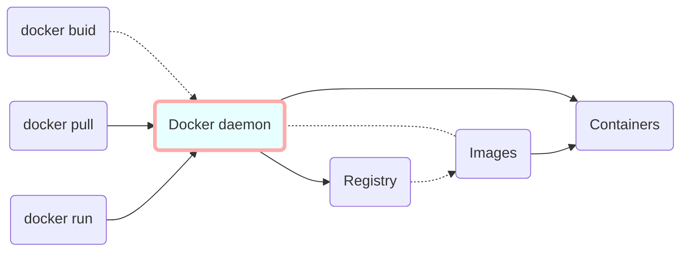

# Docker

# 



# 1. Docker 安装

## 1.1. 卸载就版本

```bash
$ sudo yum remove docker \
                  docker-client \
                  docker-client-latest \
                  docker-common \
                  docker-latest \
                  docker-latest-logrotate \
                  docker-logrotate \
                  docker-engine

```

## 1.2. 安装依赖包

```bash
$ sudo yum install -y yum-utils \
                      device-mapper-persistent-data \
                      lvm2
```


## 1.3. 使用官方原地址（慢）

```bash
$ sudo yum-config-manager \
       --add-repo \
       https://download.docker.com/linux/centos/docker-ce.repo
```


## 1.4. 更换镜像阿里源

```bash
echo "OPTIONS='--registry-mirror=http://mirrors.aliyun.com/docker-ce/linux/centos/docker-ce.repo'" >> /etc/sysconfig/docker
```


## 1.5. 用 yum 安装 Docker

```bash
$ sudo yum install docker-ce docker-ce-cli containerd.io

# 指定版本安装
$ sudo yum install docker-ce-<version> docker-ce-cli-<version> containerd.io
$ yum list docker-ce --showduplicates  | sort -r  # 列出存储库的docker版本
```


## 1.6. 启动 Docker

```bash
$ sudo systemctl start docker
$ sudo systemctl enable docker
$ sudo systemctl status docker
```


## 1.7. 更新

```bash
$ yum -y upgrade  # 下载新的包，再更新
```


## 1.8. 卸载

```bash
$ sudo yum remove docker-ce docker-ce-cli containerd.io
$ sudo rm -rf /var/lib/docker
$ sudo rm -rf /var/lib/containerd
```


# 2. Docker 命令

```bash
# Docker环境信息 
docker [info|version]

# 容器生命周期管理 
docker [create|exec|run|start|stop|restart|kill|rm|pause|unpause]

# 容器操作运维 
docker [ps|inspect|top|attach|wait|export|port|rename|stat]

# 容器rootfs命令 
docker [commit|cp|diff]

# 镜像仓库 
docker [login|pull|push|search]

# 本地镜像管理 
docker [build|images|rmi|tag|save|import|load]

# 容器资源管理 
docker [volume|network]

# 系统日志信息 
docker [events|history|logs]
```


## 2.1. Docker 服务

```bash
docker -v					#查看版本
docker version 			    #查看版本详细信息
service docker start		#启动docker
chkconfig docker on		    #设置开机启动
service docker restart		#重启docker
systemctl daemon-reload 	#重新加载服务配置文件
```

 

## 2.2. Docker 容器 (Container)

```bash
docker images				      # 镜像列表
docker pull ubuntu			      # 拉取镜像
docker push seanlook/mongo	      # 推送一个image或repository到registry（push）

docker push registry.test.net:5000/mongo:2020-11-22		# registry.test.net也可以写成IP

# 指定地址：myregistry.local:5000 拉取镜像文件：testing/test-image
docker pull myregistry.local:5000/testing/test-image
```

 

```bash
docker run -it  ubuntu /bin/bash		# 启动容器，命令行模式进入ubuntu 容器,
	## 运行命令后终端命令行变成 [root@(一串 hash Id)] 的形式说明成功进入ubuntu容器
docker run -itd --name ubuntu-test ubuntu /bin/bash	# 启动容器，后台模式启动

attach		    # 退出容器，会导致容器的停止
exit 			# 退出容器，不会导致容器的停止 
docker exec -it 13847afe2fbc/bin/bash		#从这个容器退出，不会导致容器的停止 

docker ps 		    # 默认显示当前正在运行中的container
docker ps -a		# 查看所有容器信息（包括已停止的）
docker ps -l 		# 显示最新启动的一个容器（包括已停止的） 

docker start  <容器 ID或Name>		# 启动已存在的容器（run:从image新建容器再启动）
docker stop  <容器 ID或Name>		# 停止容器
docker restart <容器 ID或Name>		# 重启容器
docker container prune	 # 清理所有处于终止状态的容器 
# 或者
docker rm $(docker ps -a -q)
```

 

```bash
docker export CONTAINER<容器 ID或Name>	>xxx.tar	      # 导出容器
docker export dd43b6de6b33 >/opt/ubuntu.tar		        # 导出示例
docker import - /opt/ubuntu.tar					        # 导入容器
cat docker/ubuntu.tar | docker import - test/ubuntu:v1	# 导入容器
docker import http://example.com/exampleimage.tgz example/imagerepo	# 从指定地址导入容器
docker rm -f <容器 ID或Name>		# 删除容器
```

 

☆☆☆☆☆☆☆☆☆☆☆☆

\# 运行web容器，-d 后台运行，-p容器80端口映射端口到主机端口8001，默认随机

$ docker run -d --restart=always --name=spug -p 8001:80 registry.aliyuncs.com/openspug/spug

\# 持久化存储启动命令：

\# mydata指的是本地磁盘路径，也可以是其他目录，但需要保证映射的本地磁盘路径已经存在，/data是容器内代码和数据初始化存储的路径

docker run -d --restart=always --name=spug -p 80001:80 -v /mydata/:/data registry.aliyuncs.com/openspug/spug

Docker安装，版本更新

docker exec -i spug python3 /data/spug/spug_api/manage.py update

docker restart spug

 

docker port  <容器 ID或Name>		#查看web到容器的端口映射

docker logs -f <容器 ID或者Name>		#查看web容器的日志

docker top  <容器 ID或者Name>		#查看web容器的进程

docker inspect <容器 ID或者Name>		#检查web应用程序，查看 Docker 的底层信息

 

## 2.3. Docker 镜像

docker images									#本地镜像列表

docker image inspect nginx:latest | grep -i version 	#查看镜像具体信息

docker search [option] keyword	#搜索镜像

docker pull ubuntu				#拉取镜像

docker rmi ubuntu:latest		  #删除镜像

docker tag <IMAGE ID> test/ubuntu:dev		#设置镜像标签

 

docker image rmi  <id|name>		# 删除镜像

docker rmi imagename:tag		# 有依赖的子镜像以”镜像名：标签”方式删除

docker images|grep none|awk '{print $3}'|xargs docker rmi		#删除所有tag为none的镜像

docker rmi $(docker images | grep "none" | awk '{print $3}') 

 

docker commit -m="备注" <容器 ID或者Name> [repo:tag] 	#保存镜像,[repo:tag]

docker build -t runoob/centos:6.7		#创建镜像

 

## 2.4. 导出 export 与 保存 save 的区别 

(1).export导出的镜像⽂件⼤⼩ ⼩于 save保存的镜像 

(2).export 导出（import导⼊）是根据容器拿到的镜像，再导⼊时会丢失镜像所有的历史，所以⽆法进⾏回滚操作（docker tag <LAYER ID> 

<IMAGE NAME>）；⽽save保存（load加载）的镜像，没有丢失镜像的历史，可以回滚到之前的层（layer）。（查看⽅式：docker images -- 

tree） 

注：导⼊加载进来觉得不合适可以使⽤ docker rm 容器ID 、 docker rmi 镜像ID 来删掉。 

移除所有的容器和镜像（⼤扫除）： 

代码如下: 

docker kill $(docker ps -q) ; docker rm $(docker ps -a -q) ; docker rmi $(docker images -q -a)

 

 

# 3. Docker-compose

(1) 运行此命令下载Docker Compose当前稳定版本：

sudo curl -L "https://github.com/docker/compose/releases/download/1.27.4/docker-compose-$(uname -s)-$(uname -m)" -o /usr/local/bin/docker-compose

 

(2) 对二进制文件应用可执行权限

sudo chmod +x /usr/local/bin/docker-compose

 

(3) 添加软链接

sudo ln -s /usr/local/bin/docker-compose /usr/bin/docker-compose

(4) 测试

$ docker-compose --version

docker-compose version 1.27.4, build 1110ad01

 

(5) 卸载

sudo rm /usr/local/bin/docker-compose

pip uninstall docker-compose	#使用pip安装的用此卸载

 

# 4. 虚拟⽹桥

docker虚拟⽹桥-多台物理主机的联⽹，容器互通，外⽹可⽤

提⽰：

Docker不再兼容CentOS6，在使⽤docker的时候请将系统进⾏升级

CentOS最低版本7.0 kernel最低3.10.0

 

注意关闭SElinux和iptables等防⽕墙

docker 默认的桥接⽹卡是docker0